[Open and Reproducible Science Advent Calendar 2019](https://adventar.org/calendars/4523)の21日目の記事です。


このアドカレも架橋に入ってきましたね。毎日途切れずOS関係の話題を聞けるのは良いですね。今日は、workflowrというRのパッケージを紹介します。


### workflowr

[**workflowr**](https://github.com/jdblischak/workflowr)は、  

- 体系化され(organized)
- 再現可能な(reproducible)
- 共有可能な（shareable)
  
データサイエンスのためのRパッケージです。

もう少し具体的には、


##### 体系化(organized)
- 体系化されたサブディレクトリで構成されたプロジェクトのテンプレートを提供
- 解析コードと結果をRmarkdownで統合
- Gitを使ってソースコードと結果のバージョンコントロール
   
##### 再現性(Reproducible)
- コードのバージョンを表示
- 各分析を独立のRセッションで実行
- 各分析のセッション情報を記録
- 乱数生成のseed値を固定

##### 共有可能（Shareable）
- 研究結果を掲載するウェブサイトを構築
- Github PagesやGitLab Pagesを使って無料でウェブサイトがホストできちゃう
- 過去の結果のバージョーンのリンクを生成できる  


これ全部Rstudioでできちゃうんです。Rstudioを統計解析のためだけのソフトと思っているそこのあなた！もう完全に古いです。ここ数年でRのドキュメント周りの進化は凄まじく、Rstudioを使って、ウェブサイト、ブログサイトなどとても簡単に作れるようになりました。私や国里さんや小杉さんなど、JCORSのメンバーもRstudioを使って自身のウェブサイトやブログサイトを構築しています。このような技術を、再現可能でオープンなデータサイエンスのプロジェクト管理ページの運用に最適化しよう、というのがこのパッケージの思想です。コードやファイルをアップしてバージョンコントロールするためにgitが活用されますが、それもRstudioとリンクしてほぼRstudioで作業が完結します。

workflowの思想 on youtube

<iframe width="560" height="315" src="https://www.youtube.com/embed/GrqM2VqIQ20" frameborder="0" allow="accelerometer; autoplay; encrypted-media; gyroscope; picture-in-picture" allowfullscreen></iframe>

<iframe width="560" height="315" src="https://www.youtube.com/embed/YmRglD2oDbY" frameborder="0" allow="accelerometer; autoplay; encrypted-media; gyroscope; picture-in-picture" allowfullscreen></iframe>


##### チュートリアル

[Getting started with workflowr: workflowr version 1.6.0](https://jdblischak.github.io/workflowr/articles/wflow-01-getting-started.html)

これに沿って進めて、どんなもんか体験してみたいと思います。

その前に必要なことは、  

- githubアカウントを作成する  
- githubにworkflowrでプロジェクトのウェブサイトのデータやコードをアップロードするためのレポジトリを作成する  

このあたりは色々とウェブ上に記事があると思うのでググってください。


まずは***workflowr***パッケージをインストールしてライブライで読み込んで、githubのユーザー名とメールアドレスを指定します。

```{r,eval=F}
library(workflowr)

# Replace the example text with your information
wflow_git_config(user.name = "xxx", user.email = "xxx@xxx.ac.jp")

```


```{r,echo=F,results="hide",eval=F}
library(workflowr)
wflow_git_config(user.name = "ytake2", user.email = "ytake2@fmu.ac.jp")

```


次に、下記を実行してみます。すると、ResearchProjectフォルダが生成されてます。


```{r,eval=F}
wflow_start("ResearchProject",git=F)
```

プロジェクトフォルダの中身は次の図のようになっていました。

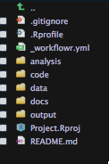

5つのフォルダがあります。  

- analysis
- code
- data
- docs
- output


中身は何もいじっていない状態で、下のコードを実行してみますと

```{r,eval=F}
wflow_build()
```
View paneにサイトが表示されます。
うおおお。
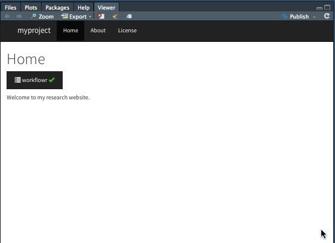


もう少し近づいてみると、

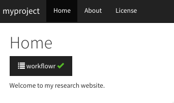

Homeタブ、Aboutタブ、Lisenseタブがデフォルトで設定されています。  

  
Homeタブのworkflowrをクリックしてみるとこんな画面が出てきて、

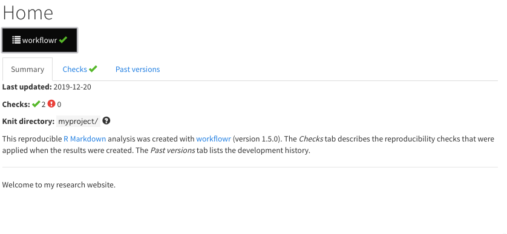

Home, About, Lisenceのすべてのタブの内部で、  

***summary***  
***checks***  
***past version**  

と3つのタブがあり、各ページのgitを通じたバージョンコントロール情報を集約させて表示してくれます。Webページ作成はworkflowrでなくてもできてしまいますが、ウェブページに自動でバージョンコントロール情報を乗せてくれるのがこのパッケージのエモいところです。普通のWebページにいちいちファイルの更新情報が細かく載っていたらうざいですが、オープンサイエンスの文脈では重要な情報になります。これまでのアドカレの記事でもあったように、研究計画をプレレジした後に変更があった場合はそれを明示して更新するなど、動的な探索的な研究では研究計画のアップデートがありえるので、いつどこで変更があったのか履歴をたどることができるのは、科学的にエモいわけです。  

次のコードで、3つRmdファイルを実行して、githubに渡す準備をします。

```{r,eval=F}
wflow_publish(c("analysis/index.Rmd", "analysis/about.Rmd", "analysis/license.Rmd"),
              "Publish the initial files for myproject")
```


次に下記のコードで***wflow_use_github("xxx")***のxxxにgithubのユーザー名を指定し実行します。


```{r,eval=F}
wflow_use_github("xxx")
```


すると、コンソールに二つの選択肢が提示されますので、お好みの方、1か2を入力します。 

1. githubのアカウントに自動でレポジトリ作りまっせ。  
2. 自分でレポジトリ作ってあとでファイルを自分でアップしてな。  


```
1. Have workflowr attempt to
automatically create the repository
"ResearchProject" on GitHub. This
requires logging into GitHub and
enabling the workflowr-oauth-app access
to the account "ytake2".

2. Create the repository
"ResearchProject" yourself by going to
https://github.com/new and entering
"ResearchProject" for the Repository
name. This is the default option.
```

手取り早く1を選択して見ましょう。

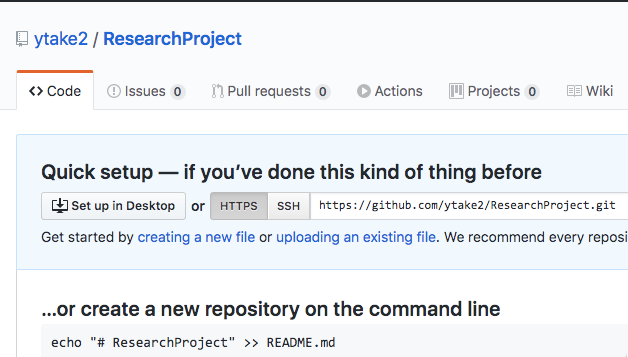


ふおおお、レポジトリできとる！  
  
  
ただ、このままではレポジトリは空です。次の手順で、手元のprojectフォルダ内のファイルをgithubに反映(push)させます。


```{r,eval=F}
wflow_git_push()
```


コンソールでgithubのユーザー名が求められるので入力するとパスワードを入力するwindowがポップアップしてくるのでそこにパスワードを入力すると、
  

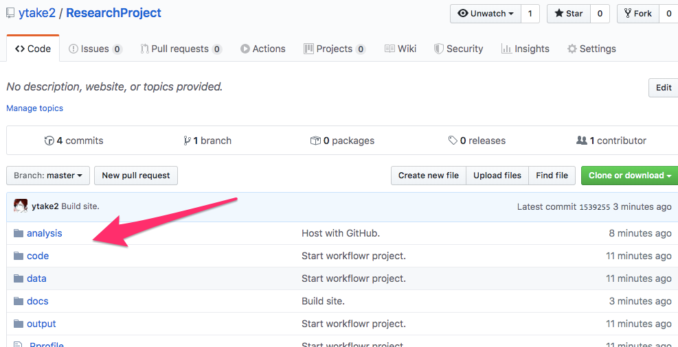

はい、projectフォルダに入っていたファイルがgithubに無事pushされました。  


最後に、これらのファイルをGithub pageの機能を使ってウェブサイトとして表示できるようにおまじないをかけます。


ResearchProjectレポジトリーの右上にある***Setteings***をクリックしGitHub PagesのSourceがNoneとなっているところを、******masterbranch/docs folder***に切り替えます。  

そうすると下記のようにgithub Pagesのウェブサイトのurlが表示されるので、そこをクリックするとviewerでみていたのと同じサイトが立ち上がっているのが確認できます。


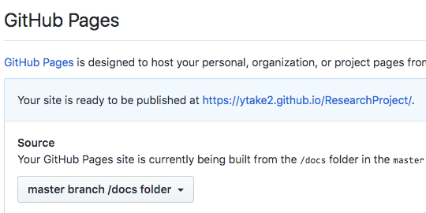

[こちらがウェブサイト](https://ytake2.github.io/ResearchProject/)


さて、ちゃんとバージョンコントロールの機能が機能しているかな、ということで、新規のファイルを追加してみましょう。

analysisフォルダに***first-analysis.Rmd***というファイルを追加します。

```{r,eval=F}
wflow_open("analysis/first-analysis.Rmd")
```


ついで、index.Rmdファイルに、上のファイルを追加しました、という情報を追記しておきましょう。

追加した.Rmdファイルと変更した.Rmdファイを指定し、commitコメントを適当につけます。

```{r,eval=F}
wflow_publish(c("analysis/index.Rmd", "analysis/first-analysis.Rmd"),
              "Add my first analysis")

```

後は先ほどと一緒で***wflow_git_push()***


最初はこの状態だったのが  

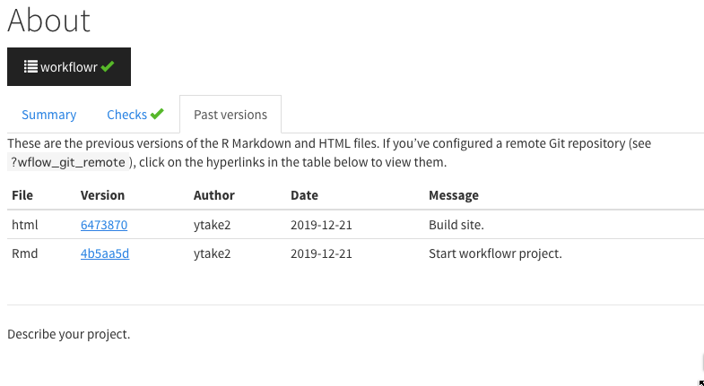

バージョンコントロールの情報が追加され

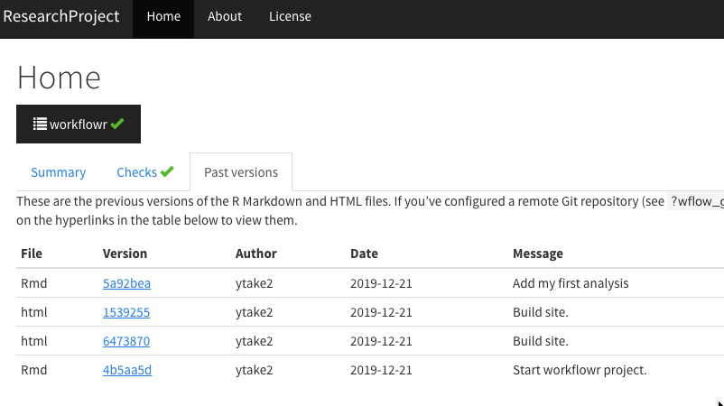

アップデート、

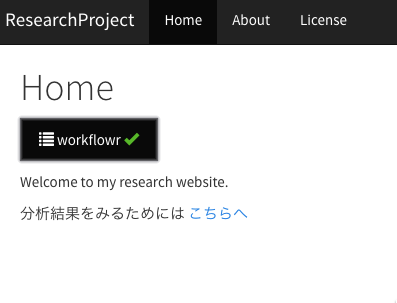

追加が反映されました。

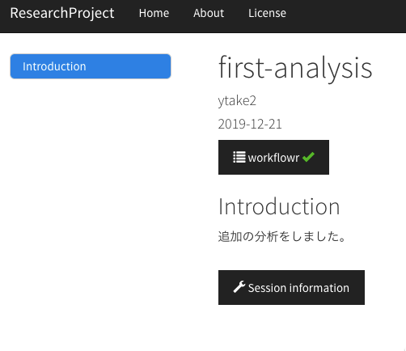


最高です。

このような枠組みで研究プロジェクトの計画、解析結果をバージョンコントロール情報もオープンにしながら共有していけるのはもう少し先の未来だと思っていたけど、既に現実なのですね。後は我々ユーザーがどう活用、普及していく仕組みを工夫していくか、というところでしょうか。来年、JCORSで色々と仕掛けていけるかどうかわかりませんが、国里さんはうずうずしているようですので皆様お楽しみに♪

それぞれのページの記載内容は.Rmdで編集すればOKで、Rmdで利用可能なテーマなど、デザインはある程度自由にアレンジできますので、お好みのデザインで研究プロジェクトのWebページを作成して楽しんでもらえたら良いでしょう。

Enjoy!!